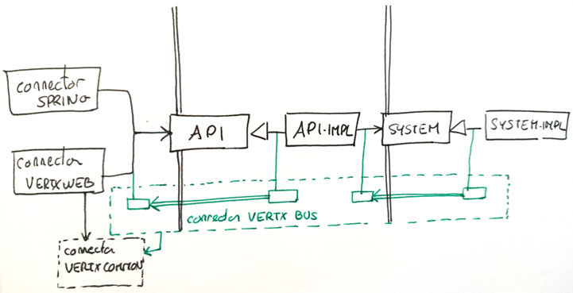
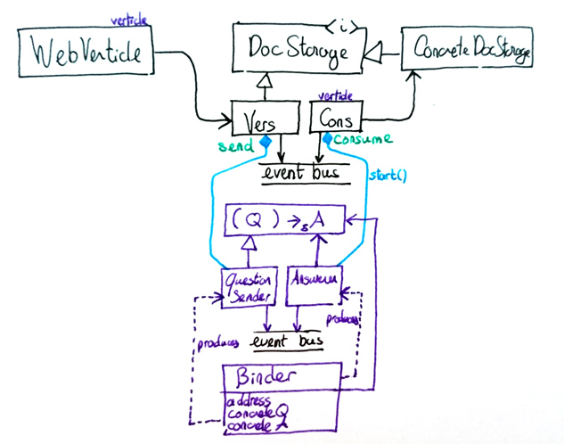

# here be dragons

**summer-flip-flop** is my scratch project for experimenting with various libraries, architectures, or language features

### gutes Delirium architektur

may or may not include the following:

- hexagonal architecture
- asynchronous / reactive
- actor model pattern
- uses vertx event bus function adapters. binder is an utility class that:
  - produces an adapter function that can be injected (question / event bus sender)
  - produces a verticle that requires a concrete function (answerer / event bus consumer)

#### module structure

pretty much every module depends on the core module, and dependency inversion is achieved both at the implementation level as well as the module level.

i.e. the api does not depend on the system, only the implementation of the api does, and this is reflected in the module dependencies.

#### connector-vertx-bus and connector-vertx-common

they allow replacing the traditional interactions between the layers with a question-answer event bus

given a concrete function of shape `(Q) -> A` and an address, we define a binder that will produce:
  - another function of shape `(Q) -> A` that, when invoked, will send `Q` through the event bus at this address
  - a consumer that listens on the event bus at this address and invoke the concrete function and reply with `A`

so this is just RPC.

#### liquibase

in production, there is a `changelog.xml` that includes other numbered changelog files (i.e. `changelog_001.xml`, `changelog_002.xml`) ...

sometimes we need to add changesets with impact on the existing data such as non-nullable columns

in order to test these changelog files, there are two tests:

- one which executes the production `changelog.xml` with no initial data
- one which executes a test file `changelog_migration_test.xml` which includes the aforementionned production numbered changelog files, with with some data insertion the changesets i.e.  (i.e. `changelog_001.xml`, `initial_data_after_1.sql`, `changelog_002.xml`)

the test for the data access object has a reference to the production code responsible for upgrading the database

