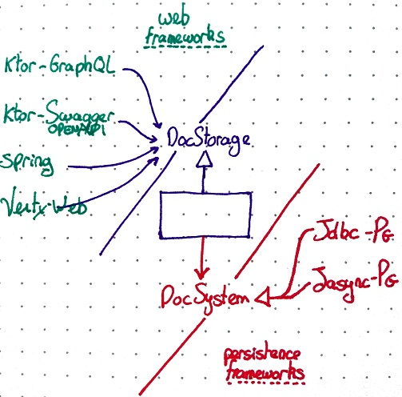

# here be dragons

**summer-flip-flop** is my scratch project for experimenting with various libraries, architectures, or language features

may or may not include the following:

- hexagonal architecture
- actor model pattern, more or less
- strict dependency inversion at module level
- asynchronous
  - via reactivex
  - via kotlin coroutines
- liquibase for schema versioning
- database component integration testing using testcontainers
- mockito-kotlin

### sections

- [async](_readme/async.md)
- [liquibase](_readme/liquibase.md)
- [vertx](_readme/vertx.md)

# quick start

to run the project locally:

- run `./do-linux-local-nonpersistent.sh` on Linux
- run `do-windows-local-nonpersistent.bat` on Windows.

this will expose a PostgreSQL container on port hosts' port 16099.

the service will be running at http://localhost:8080/docs.

### debugging

run the project locally as described in quick start so that the containers will run.

then just start one of the main classes in debug mode with the IDE.

# structure

connectors are mostly web services. they interact with the doc storage. the doc storage interacts with a persistence system.

- connectors have no knowledge of the persistence system.
- doc storage does not use frameworks.
- persistence systems have no knowledge of the doc storage nor the connectors.

