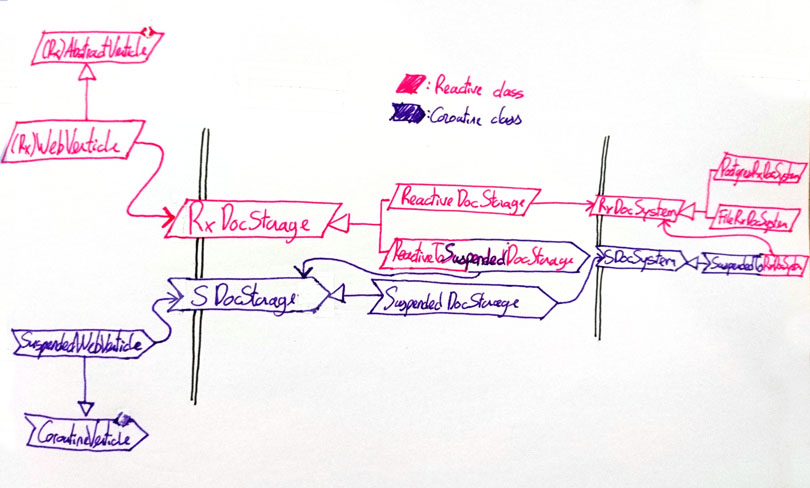

#### reactivex and coroutines

the project started with reactivex, but later on coroutines were added, so now there are coroutines implementations

sadly there is an asynchronous footprint in the function signatures and interfaces i.e. `RxDocStorage` and `SDocStorage` are two interfaces that expose the same API

what to do if a coroutine-based class needs to call a reactive-based adapter?

well, what's worse than bridging the two worlds with adapters?

- `ReactiveToSuspendedDocStorage` exposes a Reactive `RxDocStorage` and consumes a coroutine-based `SDocStorage`
- `SuspendedToRxDocSystem` exposes a coroutine-based `SuspendedDocSystem` and consumes a coroutine-based `RxDocSystem`

nothing wrong here

