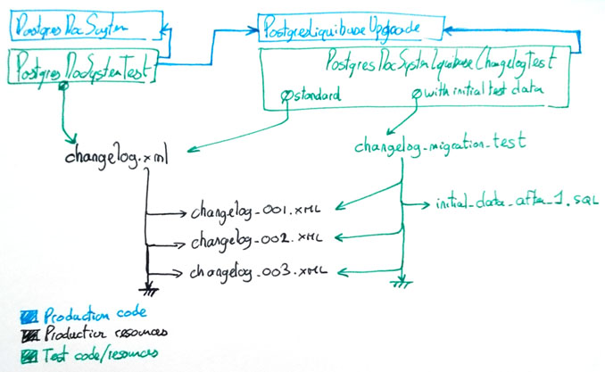

#### liquibase

in production, there is a `changelog.xml` that includes other numbered changelog files (i.e. `changelog_001.xml`, `changelog_002.xml`) ...

sometimes we need to add changesets with impact on the existing data such as non-nullable columns

in order to test these changelog files, there are two tests:

- one which executes the production `changelog.xml` with no initial data
- one which executes a test file `changelog_migration_test.xml` which includes the aforementionned production numbered changelog files, with with some data insertion the changesets i.e.  (i.e. `changelog_001.xml`, `initial_data_after_1.sql`, `changelog_002.xml`)

the test for the data access object has a reference to the production code responsible for upgrading the database

